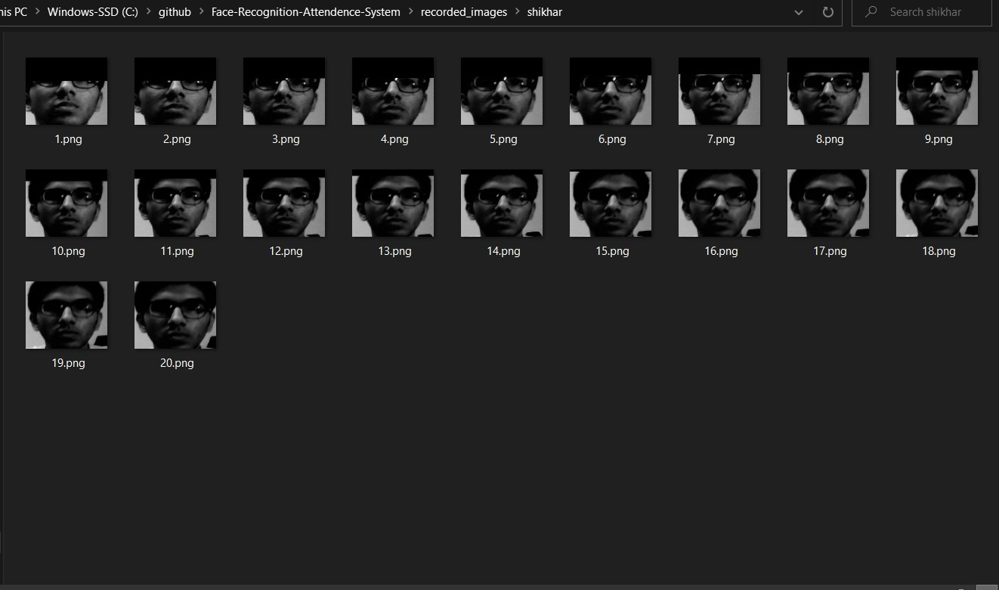
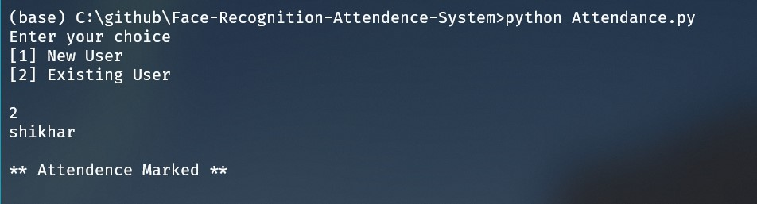

# Eagle-Eye-Attendence-System
This is an attendance system that uses face recognition to mark the attendance of a user made in Python.
Lets see how it works.

If u want to run this program on your machine these are the following **modules** that need to be installed:   
  1. numpy
  2. pandas
  3. scikit-learn 
  4. joblib 
  5. opencv

Using the program->
  Just run the attedance.py file in terminal.
  
There are a total of 4 python files for this project named as follows :
  1. attendance.py
  2. record.py
  3. train.py
  4. test.py

## attendance.py
This file is the starter, just to run the whole program we have to compile this file.This file imports the features and funtions of the 3 other py files. This file gives us the menu to choose whether to create a new user or use an existing user.

## record.py
This program records the images of the user who wants to mark their attendance.
A total of 20 images are recorded to use for training puposes in the next stage.
They are resized and converted to grayscale.

A pre tained haar cascade classifier is used in the file.

**What is Haar cascade classifier ??** 

Haar Cascade is a machine learning object detection algorithm used to identify objects in an image or video.It is a machine learning based approach where a cascade function is trained from a lot of positive and negative images. It is then used to detect objects in other images.

## train.py
In this file the images are used for training purposes.
15 previously recorded images are taken and passed through a **hog** feature extractor.

Now since haar cascade is a machine learning algorithm thats why we need to manually extarct the features by using this HOG extracter.
Finally the model is support vector classifier model is trained.

**What is HOG??**

Histogram of Oriented Gradients, is a feature descriptor that is often used to extract features from image data. It is widely used in computer vision tasks for object detection.

## test.py
This is the final stage and used if the user is already existing and wants to mark attendance.
The camera takes 10 images and predicts the output that is stored in the list where the output that is in majority (as it cant be 100 % accurate) is used are our final answer. And attendance is marked.

